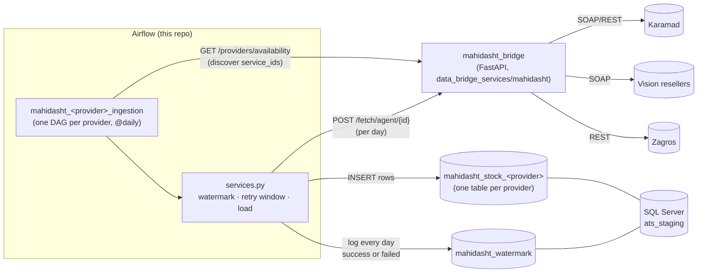
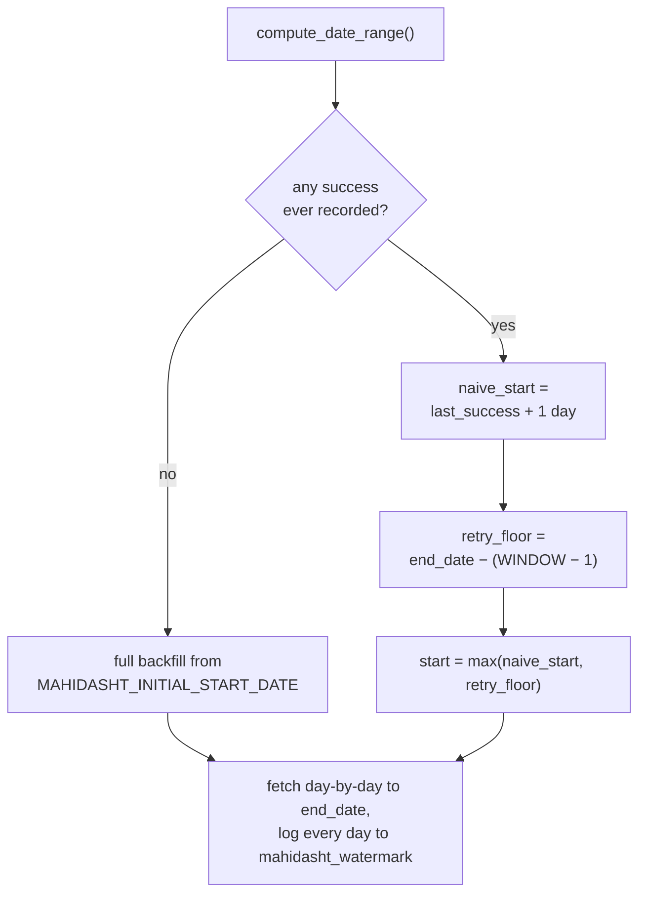

# Airflow — ATS Ingestion Platform


Self-hosted Apache Airflow instance (webserver, scheduler, triggerer) that
runs the ATS platform's daily data-ingestion DAGs. Every DAG lands its data
in SQL Server (`ats_staging`); the biggest piece by far is **Mahidasht**, a
multi-provider inventory-sync pipeline described below.

## Contents

- [Architecture](#architecture)
- [Quick start](#quick-start)
- [DAGs](#dags)
- [Mahidasht ingestion, in depth](#mahidasht-ingestion-in-depth)
- [Configuration](#configuration)
- [Project layout](#project-layout)
- [Operating it](#operating-it)

## Architecture



Each provider gets its **own destination table** (`mahidasht_stock_karamad`,
`mahidasht_stock_vision`, `mahidasht_stock_zagros`, …) and its **own DAG**
(`mahidasht_karamad_ingestion`, etc.), generated dynamically at parse time
from whichever `service_id`s `mahidasht_bridge` currently reports for that
provider — so wiring up a new agent doesn't require touching this repo.

## Quick start

```bash
cp .env.example .env   # fill in real secrets - see Configuration below
docker compose up -d --build
```

| Service | URL |
|---|---|
| Airflow UI | http://localhost:3020 |
| Airflow REST API | http://localhost:3020/api/v1 |

DAGs are paused on creation (`AIRFLOW__CORE__DAGS_ARE_PAUSED_AT_CREATION=true`)
— unpause the ones you want running from the UI or:

```bash
docker exec airflow_scheduler airflow dags unpause mahidasht_karamad_ingestion
```

## DAGs

| DAG | Schedule | What it does |
|---|---|---|
| `mahidasht_karamad_ingestion` | `@daily` | One task per Karamad `service_id`, fetched via `mahidasht_bridge` |
| `mahidasht_vision_ingestion` | `@daily` | Same, for Vision (SOAP) resellers |
| `mahidasht_zagros_ingestion` | `@daily` | Same, for Zagros (bearer-token REST) |
| `excel_api_extraction_loop` | manual | Drives the `ats-excel-data-extraction` API's `/targets` → `/extract` loop over every registered sheet |

The three `mahidasht_*` DAGs are all generated by
[`dags/mahidasht_ingestion_dag.py`](dags/mahidasht_ingestion_dag.py) — it
reads the provider list from [`dags/mahidasht/config.json`](dags/mahidasht/config.json),
calls `discover_service_ids()` for each, and builds one DAG + one task per
agent. Adding a fourth provider is a one-line change to `config.json`
(plus, of course, an extractor for it on the `mahidasht_bridge` side).

## Mahidasht ingestion, in depth

The interesting logic lives in [`dags/mahidasht/services.py`](dags/mahidasht/services.py).

**Per-day watermark, not just a pointer.** `mahidasht_watermark` logs one
row per `(provider, service_id, date)` — not just "the last date we got
to" — recording `success`/`failed`, row count, how long the fetch took
(`duration_seconds`), and on failure the upstream error text
(`response_body`), so a day that fails is fully diagnosable later without
digging through Airflow logs.

**Bounded retry, not infinite backlog.** Each run resumes from
*last successful day + 1* (so a genuinely bad day gets retried, not
permanently skipped) — but retries are capped at
`MAHIDASHT_FAILED_RETRY_WINDOW_DAYS` days back from the end of the window.
Without this cap, a provider whose server goes down for weeks would force
every single run to re-walk the entire failed backlog, one slow timeout at
a time, and never reach today's data. Days older than the window stay
logged as `failed` and are left alone; when a provider's server comes back
up, the next run naturally catches up.



## Configuration

All variables live in `.env` (see [`.env.example`](.env.example) for the
full, commented list). The ones worth knowing about:

| Variable | Meaning |
|---|---|
| `MAHIDASHT_BRIDGE_BASE_URL` | Where the actual `mahidasht_bridge` FastAPI service is (discovery + fetch go here) |
| `MAHIDASHT_API_BASE_URL` / `_USERNAME` / `_PASSWORD` | Login endpoint for a bearer token (cached to `dags/mahidasht/.cache/token.json`, refreshed before its 24h TTL) |
| `MAHIDASHT_WATERMARK_END_OFFSET_DAYS` | How many days behind "today" a run is willing to fetch up to (default `2`) |
| `MAHIDASHT_INITIAL_START_DATE` | Jalali start date (`YYYY/MM/DD`) for a brand-new agent's first backfill |
| `MAHIDASHT_FAILED_RETRY_WINDOW_DAYS` | How many days back a run will retry `failed` days (default `7`) — see above |
| `MSSQL_*` | Destination SQL Server connection (`ats_staging`) |

`dags/mahidasht/.cache/` (bearer token + discovered `service_id` lists) is
gitignored on purpose — it's runtime state, regenerated automatically.

## Project layout

```
airflow/
├── dags/
│   ├── mahidasht_ingestion_dag.py   # builds one DAG per provider
│   ├── mahidasht/
│   │   ├── config.json              # provider list
│   │   ├── auth.py                  # bearer-token login + cache
│   │   ├── discovery.py             # live service_id discovery (+ cache fallback)
│   │   └── services.py              # watermark, retry window, fetch, load
│   └── excel_api_extraction_dag.py
├── Dockerfile                       # apache/airflow base + mssql odbc driver
├── docker-compose.yaml              # webserver, scheduler, triggerer, init
├── requirements/requirements.txt
└── .env.example
```

## Operating it

Check whether a provider is actually reachable right now (bypasses the
DAG, hits `mahidasht_bridge` directly):

```bash
curl "http://localhost:8000/providers/availability?providers=vision"
```

Run one task ad hoc, without waiting for the schedule:

```bash
docker exec airflow_scheduler airflow tasks test mahidasht_zagros_ingestion fetch_service_22 $(date +%F)
```

See the full per-day history for one agent (success/failed, row counts,
timings, and the error text for anything that failed):

```sql
SELECT last_fetched_date_jalali, last_status, last_row_count,
       duration_seconds, response_body
FROM dbo.mahidasht_watermark
WHERE provider = 'vision' AND service_id = 39
ORDER BY last_fetched_date;
```
